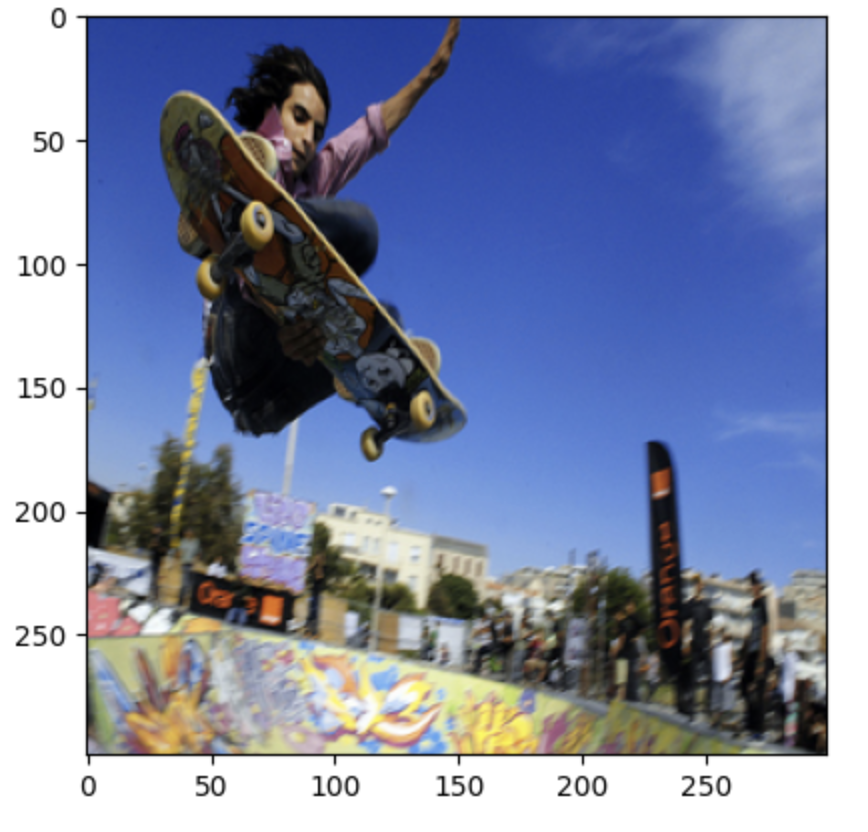
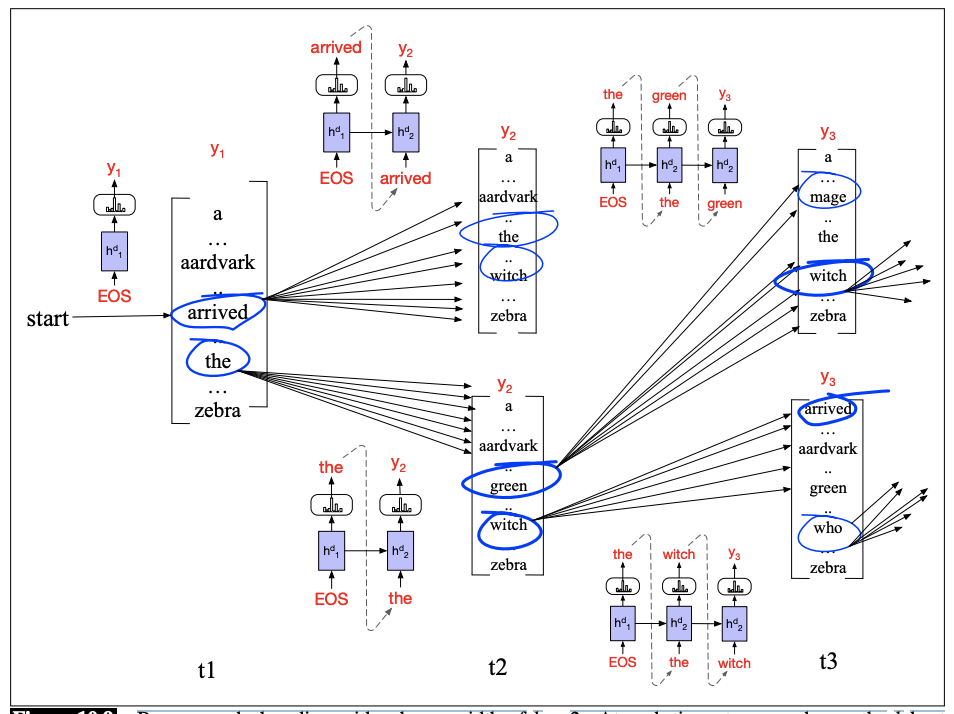
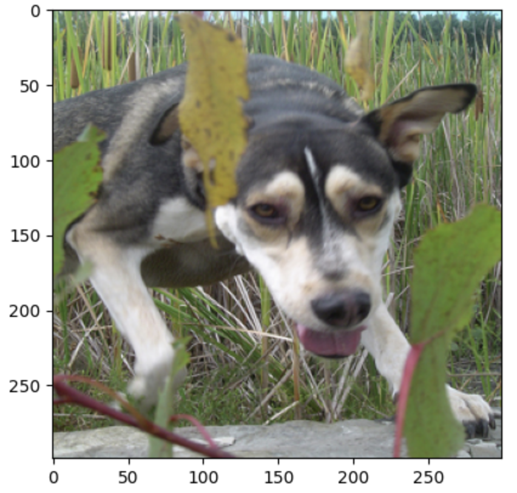

# Flickr Image Captioning LSTM

## Introduction

This project was completed as part of my Columbia University NLP course.

**Task**

- (part 1) Create matrices of image representations using an off-the-shelf image encoder.
- (part 2) Read and preprocess the image captions.
- (part 3) Write a generator function that returns one training instance (input/output sequence pair) at a time.
- (part 3) Train an LSTM language generator on the caption data.
- (part 3) Write a decoder function for the language generator.
- (part 4) Add the image input to write an LSTM caption generator.
- (part 5) Implement beam search for the image caption generator.

**Data:** flickr8k data

### Part 1: Image Encodings

**Inception V3 network:** off-the-shelf pre-trained image encoder. This model is a CNN used for object detection.

1.  Resize images: Convert Flikr images to be (299 x 299) pixels with RGB values between 0 and 1.0.
2.  Encode each image as a vector of size 2048 and store them in one big matrix (enc_train, enc_dev, enc_test)

### Part 2: Text (Caption) Data Preparation

Load image captions and generate training data for the generator model.

1. Read image descriptions: Create a dictionary with the key as the image name and values as a list of 5 possible captions (tokenized and padded with <'START'> and <'END'>)
2. Create word indices: Write two functions: (1) word_to_id and (2) id_to_word

### Part 3: Basic Decoder Model

In this part, we train a model for text generation. We use a Bidirectional LSTM to encode the sequence from both directions and then predict the output.

We then use a greedy decoder to predict the most probable next word for each partial sentence, until we arrive at a full sequence. Using argmax each time, we get the following sentence:

[<'START'>, 'A', 'man', 'in', 'a', 'red', 'shirt', 'is', 'jumping', 'off', 'a', 'hill', 'with', 'a', 'skateboard', '.', '<'END'>']

An improvement to the greedy decoder uses np.random.multinomial, which allows us to sample the next word from the distribution (the softmax activated output), instead of choosing the most likely word at each step.

- ['<'START'>', 'A', 'dog', 'running', 'down', 'a', 'dirt', 'path', '.', '<'END'>']
- ['<'START'>', 'A', 'group', 'of', 'people', 'standing', 'in', 'a', 'Tye-dyed', '4x4', 'hallway', '.', '<'END'>']
- ['<'START'>', 'A', 'dog', 'runs', 'through', 'a', 'field', '.', '<'END'>']
- ['<'START'>', 'A', 'dog', 'running', 'down', 'a', 'Winnie', 'banks', 'with', 'a', 'big', 'stick', 'in', 'his', 'mouth', '.', '<'END'>']
- ['<'START'>', 'A', 'boy', 'in', 'a', 'a', 'yellow', 'shirt', 'is', 'riding', 'a', 'bike', 'on', 'a', 'riding', 'white', '.', '<'END'>']
- ['<'START'>', 'A', 'man', 'in', 'a', 'red', 'shirt', 'is', 'jumping', '.', '<'END'>']
- ['<'START'>', 'A', 'kid', 'in', 'a', 'red', 'shirt', 'is', 'jumping', 'off', 'a', 'bike', 'into', 'a', 'lake', '.', '<'END'>']
- ['<'START'>', 'A', 'dog', 'runs', 'through', 'a', 'field', 'with', 'a', 'stick', 'in', 'his', 'mouth', '.', '<'END'>']
- ['<'START'>', 'A', 'brown', 'dog', 'is', 'leaping', 'in', 'a', 'blue', 'couch', '.', '<'END'>']
- ['<'START'>', 'A', 'dog', 'jumps', 'to', 'catch', 'a', 'Frisbee', '.', '<'END'>']

At this point, the decoder is generating captions randomly and without an image input.

### Part 4: Conditioning on the Image

Here, we extend the model to condition the next word on (1) the partial sequence, (2) the encoded image.

We project the 2048-dimensional image encoding to a 300-dimensional hidden layer. We then concatenate this vector with each embedded input word, before applying the LSTM.

['<'START'>', 'A', 'young' , 'boy' , 'wearing' , 'a' , 'green' , 'shirt' , 'is' , 'jumping' , 'off' , 'a' , 'ramp', '.' , '<'END'>']

### Part 5: Beam Search Decoder

From [Jurafsky and Martin's textbook, chp 10](https://web.stanford.edu/~jurafsky/slp3/10.pdf):

'Greedy search is not optimal, and may not find the highest probability translation.
The problem is that the token that looks good to the decoder now might turn out later
to have been the wrong choice'

**Beam Search**: In beam search, instead of choosing the best token to generate at each timestep, we keep k possible tokens at each step.

- **Greedy**:  ['<'START'>', 'A', 'dog', 'is', 'running', 'through', 'the', 'woods', '.', '<'END'>']
- **Beam n=3**:  ['<'START'>', 'A', 'black', 'and', 'white', 'dog', 'is', 'running', 'through', 'a', 'field', '.', '<'END'>']
- **Beam n=5**:  ['<'START'>', 'A', 'black', 'and', 'white', 'dog', 'is', 'running', 'in', 'a', 'field', '.', '<'END'>']

